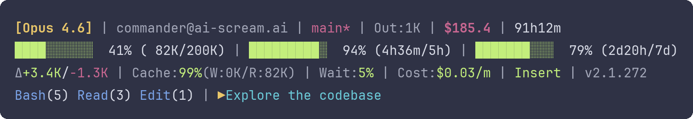
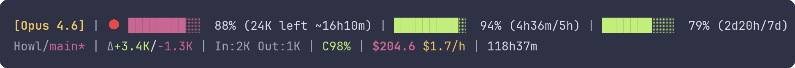

#  Howl

> _"Your AI screams — Howl listens."_

A statusline HUD for [Claude Code](https://code.claude.com), written in Go. It reads the JSON Claude Code pipes to a status line command and prints context, quota, cache, cost, git and tool activity as up to four ANSI lines — a few milliseconds on its own, about twenty with git and the transcript read (see [Performance](#performance)) — with no dependencies beyond the Go standard library.

**Website:** [ai-scream.ai/Howl](https://ai-scream.ai/Howl/) · **Brand and icon:** [docs/brand.md](docs/brand.md)

[](https://go.dev)
[](https://github.com/ai-screams/howl/releases)
[](https://github.com/ai-screams/howl/releases)
[](https://github.com/ai-screams/howl)
[](LICENSE)
[](https://github.com/ai-screams/howl/commits)
[](https://github.com/ai-screams/howl/graphs/commit-activity)

[](https://github.com/ai-screams/howl/actions)
[](https://goreportcard.com/report/github.com/ai-screams/howl)
[](https://pkg.go.dev/github.com/ai-screams/howl)
[](https://conventionalcommits.org)

[](https://github.com/ai-screams/howl/releases)
[](https://github.com/ai-screams/howl/releases)
[](https://code.claude.com)
[]()
[](https://github.com/ai-screams/howl/issues)

---



_Normal mode on the `full` preset: a 200K-context session at 41 %. Rendered from the current binary by `scripts/brand/render-statusline.py`._

---

## Table of Contents

- [Features](#features)
- [Installation](#installation)
- [Updating](#updating-)
- [Uninstallation](#uninstallation)
- [Usage](#usage)
- [Architecture](#architecture)
- [Performance](#performance)
- [Development](#development)
- [Configuration](#configuration)
  - [Custom Thresholds](#custom-thresholds)
- [Troubleshooting](#troubleshooting)
- [Why Howl?](#why-howl)
- [Roadmap](#roadmap)
- [Contributing](#contributing)
- [License](#license)
- [Credits](#credits)

---

## Features

### Intelligent Metrics 📊

- **Cache Efficiency** — Track prompt cache utilization (80%+ = excellent)
- **API Wait Ratio** — See how much time spent waiting for AI responses
- **Cost Velocity** — Monitor spending rate ($/minute)

### Essential Status 🎯

- **Model Tier Badge** — Color-coded Opus (gold) / Sonnet (cyan) / Haiku (green)
- **Context Health Bar** — Visual 10-char bar with 4-tier gradient
- **Token Absolutes** — See exact usage (210K/1M) with adaptive K/M formatting
- **Usage Quota** — Live 5h/7d limits with reset countdowns (reads `rate_limits` from stdin; requires Claude.ai subscriber + CC 2.1.80+)

### Workflow Awareness 🔧

- **Git Integration** — Branch name + dirty status (`main*`)
- **Code Changes** — Track lines added/removed with color coding
- **Tool Usage** — Top 5 most-used tools (Read, Bash, Edit...)
- **Active Agents** — See running subagents in real-time
- **Vim Mode** — N/I/V indicators for modal editing

### Custom Thresholds ⚡

- **15 Configurable Values** — Control when every color changes and when danger mode activates
- **Per-Group Tuning** — Context, cost, cache, API wait, cost velocity, quota
- **Interactive Setup** — Use `/howl:threshold` to adjust values conversationally
- **Safe Defaults** — Invalid values auto-corrected, zero values ignored

### Optional Feature Toggles (default off) 🔧

Enable individually via `features` in `~/.claude/hud/config.json` or `/howl:customize`:

- **output_tokens** — Current-response output token count (`Out:1K`) — truthful replacement for the removed tok/s metric; reads `current_usage.output_tokens` directly
- **effort** — Shows current effort level (`E:high`)
- **thinking** — Shows extended thinking indicator (`Think`)
- **session_name** — Shows truncated session name
- **pull_request** — Shows linked PR (`PR#1234 pending`). Labels GitLab merge requests `MR#` via `pr.kind` (CC 2.1.234+), and links the badge to `pr.url` with an OSC 8 hyperlink where the terminal supports one
- **worktree** — Shows active git worktree (`wt:name`). Falls back to `workspace.git_worktree`, which is populated for any linked worktree, not just worktree sessions
- **prompt_cache** — Session-wide prompt cache state (CC 2.1.251+): hit ratio (`Hit:97%`), time until the cached prefix goes cold (`warm:0h42m`), and rebuilds with their likely cause (`miss:2 tools_changed`). Distinct from **cache_efficiency**, which describes only the most recent API call
- **fast_mode** — Marks a session running in fast mode (`↯`)
- **exceeds_200k** — Warns when the last response crossed 200k total tokens (`>200K`). This threshold is fixed regardless of window size, so on a 1M-context model the context bar can read low while this is already true
- **output_style** — Names the active output style; the `default` style is skipped
- **repo** — Repository from the `origin` remote (`owner/name`), parsed by Claude Code, so it costs no git subprocess
- **added_dirs** — Count of extra directories added with `/add-dir` (`+2d`)
- **hide_update_notice** — Opt **out** of the update badge described under [Updating](#updating-). Inverted because feature overrides can only turn things on, and this one is on by default: a notice nobody enabled tells nobody anything. Setting it also stops the daily version check

### Subagent Panel Rows 🧵

Howl can also render the agent panel rows below the prompt, replacing the default
`name · description · token count` with a per-row context percentage computed from
each task's own model window:

```json
{
  "subagentStatusLine": {
    "type": "command",
    "command": "~/.claude/hud/howl --subagent"
  }
}
```

Each row shows `name · status · ctx% (tokens) · E:effort`, omitting any segment Claude
Code did not supply and dropping trailing segments rather than wrapping. Rows Howl has
nothing to add to keep their default rendering. Per-task `model` and `contextWindowSize`
require CC 2.1.205+; `effort` requires CC 2.1.214+ and accepts either a level name or a
numeric token budget.

### Adaptive Layouts 🎨

- **Normal Mode** (< 85% context, configurable) — up to four lines, added as features activate
- **Danger Mode** (85%+ context, configurable) — Dense 2-line view with token breakdown and hourly cost
- **Width-Aware Rendering** — Tool/agent line sizes to `COLUMNS` env var (clamped 40–240, fallback 80; requires CC 2.1.153+)

---

<a name="installation"></a>

## Installation 💾

Choose your preferred installation method:

### Method 1: Claude Code Plugin (Recommended) 🔌

This repository is its own plugin marketplace. Add it, install the plugin, and let the setup skill place the binary:

```bash
/plugin marketplace add ai-screams/howl
/plugin install howl@ai-screams-howl
/howl:setup
```

The `/howl:setup` skill automatically:

- Downloads the correct binary for your OS/architecture
- Installs to `~/.claude/hud/howl`
- Configures `~/.claude/settings.json`
- Backs up existing settings

After installation, use `/howl:configure` to choose a preset, `/howl:customize` to turn individual metrics on top of it, or `/howl:threshold` to tune color breakpoints and the danger mode trigger.

---

### Method 2: Direct Binary Download 📦

Download the latest binary from [GitHub Releases](https://github.com/ai-screams/howl/releases/latest):

```bash
mkdir -p ~/.claude/hud

# macOS (Apple Silicon)
curl -fsSL https://github.com/ai-screams/howl/releases/latest/download/howl_darwin_arm64 -o ~/.claude/hud/howl

# macOS (Intel)
curl -fsSL https://github.com/ai-screams/howl/releases/latest/download/howl_darwin_amd64 -o ~/.claude/hud/howl

# Linux (x86_64)
curl -fsSL https://github.com/ai-screams/howl/releases/latest/download/howl_linux_amd64 -o ~/.claude/hud/howl

# Linux (ARM64)
curl -fsSL https://github.com/ai-screams/howl/releases/latest/download/howl_linux_arm64 -o ~/.claude/hud/howl

chmod +x ~/.claude/hud/howl
```

Then add to `~/.claude/settings.json`:

```json
{
  "statusLine": {
    "type": "command",
    "command": "/Users/YOUR_USERNAME/.claude/hud/howl"
  }
}
```

Verify: `~/.claude/hud/howl --version`

---

### Method 3: Build from Source 🛠️

Prerequisites: Go 1.26+, Claude Code CLI

```bash
git clone https://github.com/ai-screams/howl.git
cd howl
make install
# Binary installed to ~/.claude/hud/howl
```

`make install` copies the binary and prints the `statusLine` block to add to `~/.claude/settings.json`; it does not edit the file. Add the block shown under [Method 2](#method-2-direct-binary-download-) yourself, or run `scripts/install.sh`, which does.

---

### Post-Installation ✅

Restart Claude Code to activate the statusline. The HUD will appear at the bottom of your terminal.

---

## Updating 🔄

### If installed via Plugin

**Turn on auto-update first — it is off by default.** Claude Code enables
auto-update for its own marketplaces, not for third-party ones like this. Until
you turn it on, the plugin stays on whatever version you installed:

```
/plugin  →  Marketplaces  →  ai-screams-howl  →  Enable auto-update
```

With it on, updates arrive on their own:

1. Claude Code refreshes the plugin after session start, with a delay of up to ten minutes.
2. The plugin's `SessionStart` hook notices the version changed and re-downloads the matching binary in the background.

Keeping the binary in step is a no-op with no download when the versions already
match; the hook only ever updates an existing install and never blocks session
start. Its one network call is the daily update check described next. Your configuration at
`~/.claude/hud/config.json` is preserved across updates.

To update immediately instead of waiting:

```bash
claude plugin marketplace update ai-screams-howl
claude plugin update howl@ai-screams-howl
```

Or re-run `/howl:setup`, which downloads the latest release directly.

#### You will be told when you are behind

Claude Code has no "update available" indicator — its plugin list does not carry
the notion — so Howl shows its own. The `SessionStart` hook asks GitHub for the
latest release at most once a day, in the background, and the status line shows
`↑1.11.0` on its first line when you are behind. The check never runs from the
status line itself, which has to stay at roughly ten milliseconds.

This matters most if you skipped the auto-update toggle: the badge is then the
only thing that will ever tell you a new version exists.

Set `hide_update_notice` to turn the badge off, which also stops the daily check:

```json
{ "features": { "hide_update_notice": true } }
```

### If installed via Direct Download

Re-download the latest binary:

```bash
curl -fsSL https://github.com/ai-screams/howl/releases/latest/download/howl_$(uname -s | tr '[:upper:]' '[:lower:]')_$(uname -m | sed 's/x86_64/amd64/;s/aarch64/arm64/') \
  -o ~/.claude/hud/howl && chmod +x ~/.claude/hud/howl
```

### If built from Source

```bash
cd howl && git pull && make install
```

No restart needed — changes apply on the next refresh.

---

<a name="uninstallation"></a>

## Uninstallation 🗑️

### If installed via Plugin

```bash
/plugin uninstall howl@ai-screams-howl
```

This removes the plugin but keeps the binary. To remove everything:

```bash
/plugin uninstall howl@ai-screams-howl
rm ~/.claude/hud/howl
```

Then remove the `statusLine` field from `~/.claude/settings.json`.

### If installed manually

1. Remove binary: `rm ~/.claude/hud/howl`
2. Remove `statusLine` field from `~/.claude/settings.json`
3. Restart Claude Code

---

## Usage

Claude Code runs the status line command itself: on every new message, after `/compact`, on mode changes, on its `refreshInterval` timer, and when a rate limit or the prompt cache expires, debounced at 300 ms. Howl reads one JSON document from stdin each time and prints the lines. There is nothing to start or keep running.

### Example Output

Both pictures below come out of `scripts/brand/render-statusline.py`, which feeds fixed sessions to the built binary and draws its output, so they track the renderer instead of aging.

**Normal mode (41 % of a 200K context, `full` preset):**


<details>
<summary>Text output (for accessibility)</summary>

```
[Opus 4.6] | commander@ai-scream.ai | main* | Out:1K | $185.4 | 91h12m
████░░░░░░  41% ( 82K/200K) | █████████░  94% (4h36m/5h) | ███████░░░  79% (2d20h/7d)
Δ+3.4K/-1.3K | Cache:99%(W:0K/R:82K) | Wait:5% | Cost:$0.03/m | Insert | v2.1.272
Bash(5) Read(3) Edit(1) | ▶Explore the codebase
```

</details>

**Danger mode (88 % of a 200K context):**



<details>
<summary>Text output (for accessibility)</summary>

```
[Opus 4.6] | 🔴 ████████░░  88% (24K left ~16h10m) | █████████░  94% (4h36m/5h) | ███████░░░  79% (2d20h/7d)
Howl/main* | Δ+3.4K/-1.3K | In:2K Out:1K | C98% | $204.6 $1.7/h | 118h37m
```

</details>

### Metrics Explained

| Metric                | Meaning                                                                         | Color Coding                                                                         |
| --------------------- | ------------------------------------------------------------------------------- | ------------------------------------------------------------------------------------ |
| **Cache:99%**         | Prompt cache efficiency of the last call (% of input read from cache)           | Green (80%+), Yellow (50-80%), Red (<50%)                                            |
| **Wait:5%**           | Share of the session spent waiting for API responses                            | Green (<35%), Yellow (35-60%), Red (60%+)                                            |
| **Cost:$0.03/m**      | API spending rate per minute                                                    | Green (<$0.10), Yellow ($0.10-0.50), Red ($0.50+)                                    |
| **Out:1K**            | Output tokens for the current response                                          | Static (no color coding; opt-in via `output_tokens` toggle)                          |
| **94% (4h36m/5h)**    | 5-hour quota: 94% remaining, resets in 4h36m                                    | Gradient based on % remaining                                                        |
| **79% (2d20h/7d)**    | 7-day quota: 79% remaining, resets in 2d20h                                     | Gradient based on % remaining                                                        |
| **🔥 on a quota bar** | Quota window is ahead of even pace — projected to be exhausted before it resets | Appended to the quota bar; no separate toggle (shows under existing `quota` feature) |

> **Tip:** All color thresholds above are defaults. You can customize every breakpoint via `/howl:threshold` or `~/.claude/hud/config.json`. See [Custom Thresholds](#custom-thresholds) below.

> **Note:** The context window percentage shown by Howl reflects the raw `used_percentage` from Claude Code's stdin JSON. This does **not** account for the auto-compact buffer (~10-17% reserved internally by Claude Code). Actual free context before auto-compaction triggers may be lower than displayed. This is a Claude Code limitation — the auto-compact threshold is not exposed in the statusline JSON schema.

---

## Architecture

### Data Flow

```
Claude Code (new message, /compact, mode change, refresh timer,
             rate-limit or cache expiry; debounced 300 ms)
    │
    ├─ Pipes one JSON document to stdin (includes rate_limits for quota)
    │
    ▼
┌─────────────────────────────────────┐
│  Howl Binary (Go)                   │
│                                     │
│  1. Parse stdin JSON                │
│  2. Load ~/.claude/hud/config.json  │
│  3. Compute derived metrics         │
│  4. Fetch git status (1s timeout)   │
│  5. Convert rate_limits → quota     │
│  6. Parse transcript (last 100 ln)  │
│  7. Read account and update notice  │
│  8. Render ANSI output              │
│  9. Output to stdout                │
└─────────────────────────────────────┘
    │
    ▼
Claude Code Statusline Display
```

Every step after the metrics is optional: it returns nothing on failure and the renderer leaves that segment out.

### Project Structure

```
howl/
├── cmd/
│   └── howl/
│       ├── main.go          # Entry point, orchestration, --subagent mode
│       └── main_test.go     # End-to-end tests against the built binary
├── internal/
│   ├── constants.go         # Default thresholds
│   ├── types.go             # StdinData structs, model classification
│   ├── metrics.go           # Derived calculations
│   ├── render.go            # ANSI output generation
│   ├── config.go            # Presets, feature toggles, thresholds
│   ├── git.go               # Git subprocess calls
│   ├── usage.go             # rate_limits → quota converter (no I/O)
│   ├── account.go           # Account email from ~/.claude.json
│   ├── transcript.go        # JSONL parsing: tools and running agents
│   ├── update.go            # Update badge from the plugin hook's notice
│   ├── subagent.go          # Agent panel rows (howl --subagent)
│   ├── *_test.go            # Unit, integration, schema, fuzz and site tests
│   └── testdata/            # Captured payload and JSONL fixtures
├── site/                    # Product page, deployed to ai-scream.ai/Howl/
├── docs/
│   ├── brand.md             # Icon, colors, sizes, mascots
│   └── RELEASE_SETUP.md     # GitHub App setup for the release pipeline
├── assets/                  # README images (regenerated by scripts/brand)
├── skills/
│   ├── setup/SKILL.md       # /howl:setup (installation)
│   ├── configure/SKILL.md   # /howl:configure (preset selection)
│   ├── customize/SKILL.md   # /howl:customize (metric toggles)
│   └── threshold/SKILL.md   # /howl:threshold (color thresholds)
├── hooks/
│   └── hooks.json           # SessionStart hook: binary auto-update
├── scripts/
│   ├── install.sh           # Download binary + configure statusLine
│   ├── sync-binary.sh       # Keep binary in sync with plugin version
│   └── brand/               # Icon and screenshot generators
├── .claude-plugin/          # Plugin metadata (plugin.json, marketplace.json)
├── .github/workflows/       # CI, security scans, release, Pages
├── Makefile                 # Build automation
└── go.mod                   # Go module definition
```

### Key Modules

- **constants.go** — Default threshold constants (danger %, cache %, cost, quotas, timeouts)
- **config.go** — Configuration system with presets, feature toggles, and 15 customizable thresholds
- **types.go** — StdinData schema matching Claude Code's JSON output, model tier classification
- **metrics.go** — Cache efficiency, API ratio, cost velocity calculations
- **render.go** — ANSI color codes, adaptive layouts (normal up to 4 lines / danger 2 lines), threshold-driven colors
- **git.go** — Branch detection with graceful 1s timeout
- **usage.go** — Pure `rate_limits` → quota converter (no network/Keychain/cache)
- **transcript.go** — Tool usage extraction from conversation history (last ~100 lines)
- **update.go** — Reads the notice the plugin's session-start hook writes; never fetches
- **subagent.go** — Rows for the agent panel, with each task's context percentage

---

## Performance

Measured on 2026-09-26 with Howl at `v1.11.0` plus seven commits (`a222b21`), Go 1.27.1, macOS on an Apple M5 Pro. Twenty runs of the binary per row after one warm-up run, timed around the whole process (start, read stdin, render, exit). Not part of CI, so treat the numbers as a snapshot of that machine.

| Mode                                                                | Min     | Average | Max     |
| ------------------------------------------------------------------- | ------- | ------- | ------- |
| **Minimal** (stdin only; no config, git, transcript or quota)       | 3.1 ms  | 3.4 ms  | 3.8 ms  |
| **Full** (`full` preset, git in a repo, 200-line transcript, quota) | 21.1 ms | 22.5 ms | 24.4 ms |

Where the time goes in full mode: the git subprocess (branch and dirty state, 1 s timeout) is most of the difference; the transcript tail reads at most 64 KB; quota costs nothing because it arrives on stdin.

Why it stays small:

- Compiled Go binary (no interpreter startup)
- Quota read directly from stdin (no network call, no caching needed)
- Tail-only transcript parsing (vs full file scan)
- 1-second timeout on git operations
- Zero external dependencies (stdlib only)

---

## Development

### Project Commands

```bash
make build         # Compile to build/howl
make install       # Copy to ~/.claude/hud/howl
make clean         # Remove build artifacts
make test          # Smoke test with sample JSON input
make unit-test     # Run unit tests with coverage
make lint          # golangci-lint
make fmt           # go fmt
make fmt-docs      # prettier on Markdown and YAML
make check         # fmt + fmt-docs + lint + unit-test
make setup         # configure .githooks and install prettier
make release-dry   # Test GoReleaser locally (snapshot)
make release-check # Validate .goreleaser.yaml
```

Brand assets are generated, not drawn by hand:

```bash
python3 scripts/brand/build-icons.py --og FONT_DIR                            # icon, mascots, favicons, OG image
python3 scripts/brand/render-statusline.py --howl build/howl --fonts FONT_DIR # README screenshots from the binary
```

Both need Pillow; `FONT_DIR` holds `JetBrainsMono-Regular.ttf` and `JetBrainsMono-Bold.ttf` from the [JetBrains Mono release](https://github.com/JetBrains/JetBrainsMono/releases). See [docs/brand.md](docs/brand.md).

### Adding New Metrics

1. Add field to `Metrics` struct in `internal/metrics.go`
2. Implement calculation function
3. Call in `ComputeMetrics()`
4. Add render function in `internal/render.go`
5. Integrate into layout (normal/danger modes)

Example:

```go
// metrics.go
type Metrics struct {
    // ...
    NewMetric *int
}

func calcNewMetric(d *StdinData) *int {
    // calculation logic
}

// render.go
func renderNewMetric(val int) string {
    return fmt.Sprintf("%s%d%s", color, val, Reset)
}
```

Every string from outside the binary goes through `sanitizeText` before it is printed; `sanitize_test.go` fails a renderer that skips it.

---

<a name="configuration"></a>

## Configuration ⚙️

### Custom Thresholds

All 15 color breakpoints and the danger mode trigger are configurable via `~/.claude/hud/config.json`:

```json
{
  "preset": "full",
  "thresholds": {
    "context_danger": 92,
    "context_warning": 80,
    "session_cost_high": 20.0,
    "quota_high": 90
  }
}
```

Only specified values override defaults — omitted fields keep their default values.

| Group             | Thresholds                                                  | Defaults                     | Effect                                       |
| ----------------- | ----------------------------------------------------------- | ---------------------------- | -------------------------------------------- |
| **Context**       | `context_danger`, `context_warning`, `context_moderate`     | 85%, 70%, 50%                | Danger mode trigger, warning/moderate colors |
| **Session Cost**  | `session_cost_high`, `session_cost_medium`                  | $5.00, $1.00                 | Cost display color                           |
| **Cache**         | `cache_excellent`, `cache_good`                             | 80%, 50%                     | Cache efficiency color                       |
| **API Wait**      | `wait_high`, `wait_medium`                                  | 60%, 35%                     | API wait ratio color                         |
| **Cost Velocity** | `cost_velocity_high`, `cost_velocity_medium`                | $0.50, $0.10/min             | Cost velocity color                          |
| **Quota**         | `quota_critical`, `quota_low`, `quota_medium`, `quota_high` | 10%, 25%, 50%, 75% remaining | Quota color bands                            |

**Interactive setup:** Run `/howl:threshold` in Claude Code to adjust values conversationally — choose a group, set values, and see before/after comparisons.

**Validation:** Invalid values are auto-corrected (inverted pairs clamped, out-of-range values bounded). Zero or negative values are ignored. Malformed JSON falls back to all defaults silently. The file reads only `preset`, `features` and `thresholds`; any other key is dropped without a message.

Changes apply on the next refresh — no restart needed.

---

<a name="troubleshooting"></a>

## Troubleshooting 🔍

### Quota shows `?` or is absent

- Not a Claude.ai subscriber (quota only available for subscribers)
- Before the first API response in the session (quota field appears after the first call)
- Claude Code older than 2.1.80 (the `rate_limits` stdin field was added in 2.1.80)
- Each quota window (`five_hour`/`seven_day`) can be independently absent — no bar renders for that window rather than showing a fake 0%
- Fallback: Quota display is optional, all other metrics still work

### Git branch not showing

- Not a git repository
- Git timeout (1s) exceeded
- Solution: Initialize git or ignore (graceful degradation)

### Tools line empty

- Transcript file not accessible
- Session just started (no tools used yet)
- Solution: Wait for tool usage or check transcript path

### Performance slower than expected

- A slow git repository (network filesystem, huge index): git is the one subprocess, capped at 1 s
- The transcript is read from its tail only (64 KB, 100 lines), so its size does not matter
- Quota has zero latency (read from stdin)

---

## Why Howl?


Howl started because the status line is the one place a coding session can be watched without leaving it, and the numbers that matter most there — how much context is left, how much of the quota is gone, whether the cache is working, what this hour is costing — were either missing or a network call away.

- **Quota with no round trip** — the 5h and 7d windows come from the `rate_limits` field Claude Code already sends, so there is no network call, no Keychain read and nothing to cache
- **Absolute context** — `82K/200K`, not a bare percentage, and the same formatting on a 1M window
- **A cold start you cannot feel** — one static Go binary, no interpreter, no dependencies; see [Performance](#performance)
- **Danger mode** — past the threshold the layout collapses to two dense lines with tokens left, time left and hourly cost
- **Width-aware** — the tool and agent line fits the terminal's `COLUMNS`
- **Every string sanitized** — nothing from a transcript, branch name or session name can reach the terminal as an escape sequence

---

<a name="roadmap"></a>

## Roadmap 🗺️

- [ ] Custom color schemes
- [ ] Plugin system for custom metrics
- [ ] Windows support

Shipped items move to [CHANGELOG.md](CHANGELOG.md).

---

<a name="contributing"></a>

## Contributing 🤝


This is a personal tool for the AiScream project. Feedback and bug reports welcome!

---

<a name="license"></a>

## License 📄

MIT License — see [LICENSE](LICENSE) file for details.

For release history and detailed changes, see [CHANGELOG.md](CHANGELOG.md).

---

<a name="credits"></a>

## Credits 💝

**Project:** [ai-screams/howl](https://github.com/ai-screams/howl)<br>
**Author:** pignuante<br>
**Inspired by:** [claude-hud](https://github.com/jarrodwatts/claude-hud) by Jarrod Watts

Built with ❤️ and Claude Code.
