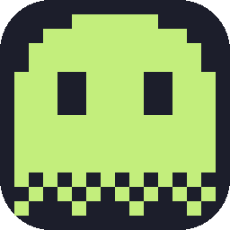
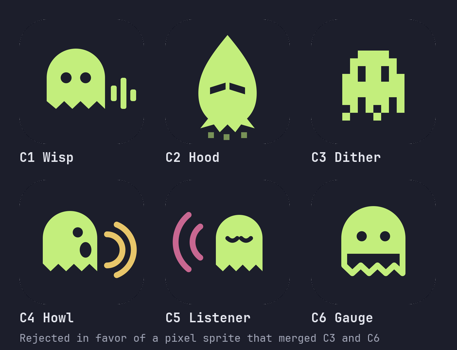
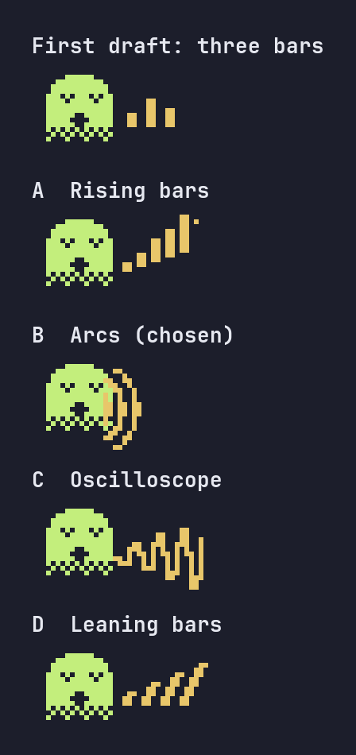

# Howl brand



Howl's mark is a wraith. Not a wolf: "Howl" is the wail of a spirit, and it sits next to Ai-Scream, the collective that ships it. The wraith is drawn on a 16-cell pixel grid, and its lower rows thin out the way the status line's bars dither. One drawing produces every size, from the 16 px favicon to the 512 px card on ai-scream.ai, scaled only by whole numbers so the pixels never blur.

Everything on this page comes out of `scripts/brand/build-icons.py`. Edit the pixel maps there, run the script, and every file below is rewritten. Never edit the PNGs by hand.

## The sprite

Fourteen cells wide, fourteen tall, centered in a sixteen-cell canvas with a one-cell margin. `X` is lime, `E` is the background showing through (the eyes), `.` is empty.

```
....XXXXXX....
..XXXXXXXXXX..
.XXXXXXXXXXXX.
.XXXXXXXXXXXX.
XXXEEXXXXEEXXX
XXXEEXXXXEEXXX
XXXEEXXXXEEXXX
XXXXXXXXXXXXXX
XXXXXXXXXXXXXX
XXXXXXXXXXXXXX
XXXXXXXXXXXXXX
X.X.X.X.X.X.X.   ▒
.X.X.X.X.X.X.X   ▒
X...X...X...X.   ░
```

The three bottom rows are the point. A ghost fades out; a status bar fills part way; on a terminal both are drawn with the same block characters. At 16 px the checker rows read as a soft band, at 512 px as crisp cells.

## Colors

| Role        | Value     | Where it comes from                                                          |
| ----------- | --------- | ---------------------------------------------------------------------------- |
| Plate       | `#1c1e2b` | The site background; one step darker than the terminal panel `#2f3245`       |
| Body        | `#c3ee7c` | The context bar's green in the README screenshots (ANSI green in that theme) |
| Eyes        | `#1c1e2b` | The plate shows through                                                      |
| Accessories | `#e8c66a` | The Opus badge gold; used for the mascots' headphones and sound arcs         |

Lime on white is 1.3:1, so the body never appears without the plate on a light page. The only plate-less rendering is the site's nav mark, which sits on the same `#1c1e2b`.

These four colors are the whole palette of the mark and the mascots. Product UI drawn next to them, such as the status line in the OG poster or on the site, uses the status line's own colors (the pink cost, the blue tool names, the greys); those belong to the product, not to the mark, and the mark does not borrow them.

## Sizes

Every output is the grid at a whole number of pixels per cell.

| File                                               | Size                                       | Cells → px    | Used for                                                                                     |
| -------------------------------------------------- | ------------------------------------------ | ------------- | -------------------------------------------------------------------------------------------- |
| `site/assets/favicon.svg`                          | viewBox 16, `shape-rendering="crispEdges"` | vector        | Browser tab (`sizes="any"`)                                                                  |
| `site/assets/favicon-16.png`                       | 16                                         | 1             | Browser tab on 1× screens; Safari, which skips SVG favicons                                  |
| `site/assets/favicon-32.png`                       | 32                                         | 2             | Browser tab on 2× screens                                                                    |
| `site/assets/apple-touch-icon.png`                 | 180                                        | 11            | iOS home screen. Opaque and unrounded: iOS applies its own mask                              |
| `site/assets/og.png`                               | 1200 × 630                                 | 4 (mark only) | Link previews; the mark sits top-left with the wordmark                                      |
| `assets/icon-64.png`                               | 64                                         | 4             | README title, displayed at 32 so 2× screens stay sharp                                       |
| `assets/icon-256.png`                              | 256                                        | 16            | Documents like this one                                                                      |
| `assets/mascot-listening.png`                      | 416 × 352                                  | 16            | README, shown at 208 wide                                                                    |
| `assets/mascot-howling.png`                        | 448 × 352                                  | 16            | README, shown at 224 wide                                                                    |
| `build/brand/howl.webp` (generated, not committed) | 512, RGBA                                  | 32            | The project card on ai-scream.ai; the alpha keeps the corners transparent on that light page |

Rules that follow from the grid:

- Scale by integers only. A 180 px touch icon is 11 px per cell, not 16 × 11.25.
- Display an image at its size or at exactly half (the README shows the 64 at 32 and the mascots at half).
- Keep one cell of clear space inside the plate; the plate's corner radius is 22 % of the shorter side.
- Do not rotate, skew, add gradients, outline, or redraw the wraith as smooth vector art. The pixels are what keep it from looking like every other ghost.

## Mascots

The same sprite with one thing added, for places that can take a face.

| Pose                                                                                            | Adds                                 | Says              | Lives in             |
| ----------------------------------------------------------------------------------------------- | ------------------------------------ | ----------------- | -------------------- |
|  | Headphones in gold, eyes closed      | "Howl listens"    | README, Why Howl?    |
|       | Mouth open, three arcs fanning right | "Your AI screams" | README, Contributing |

Both keep the plate. They are 16 px per cell and are shown at exactly half size.

## Wordmark

The icon next to the name in JetBrains Mono Bold, or in the page's display face where one is set. The OG image and the site's nav use this pairing. There is no separate logotype.

## Rejected alternatives

Six directions were drawn before the sprite, all on the same plate and lime.



| Candidate                                    | Why it lost                                                               |
| -------------------------------------------- | ------------------------------------------------------------------------- |
| C1 Wisp, a smooth ghost with a trailing wave | Without the tail it is the Ghostty and Snapchat silhouette                |
| C2 Hood, a pointed wraith with slit eyes     | Reads as a hood, not a ghost, and leaves only the eyes at 16 px           |
| C4 Howl, a profile emitting arcs             | Directional; unstable as an icon                                          |
| C5 Listener, arcs arriving from the left     | Two colors and thin arcs vanish at 16 px                                  |
| C6 Gauge, filled top and outlined bottom     | At 16 px the outlined half looks like a box; the dither band reads better |

C3, the dithered body, became the sprite; C6's idea of "how filled the ghost is" survives in its bottom rows.

The howling mascot's sound went through five drafts. Static bars looked parked; the arcs won because they spread from the mouth.



## Regenerating

```bash
python3 scripts/brand/build-icons.py               # icons, mascots, card
python3 scripts/brand/build-icons.py --og FONT_DIR # also og.png; FONT_DIR holds JetBrainsMono-Regular.ttf and -Bold.ttf
```

Pillow is the only dependency. With `--og`, the fonts are opened before anything is written, so a wrong directory changes nothing. `internal/site_test.go` checks that every file the site links to exists and that the page requests nothing from another host outside its outbound links, canonical link and Open Graph metadata, which is why the inline nav SVG has no `xmlns` attribute.
